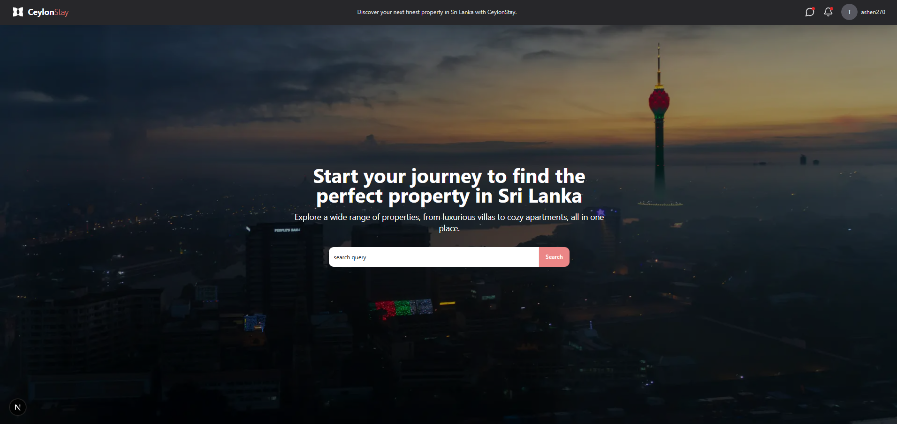
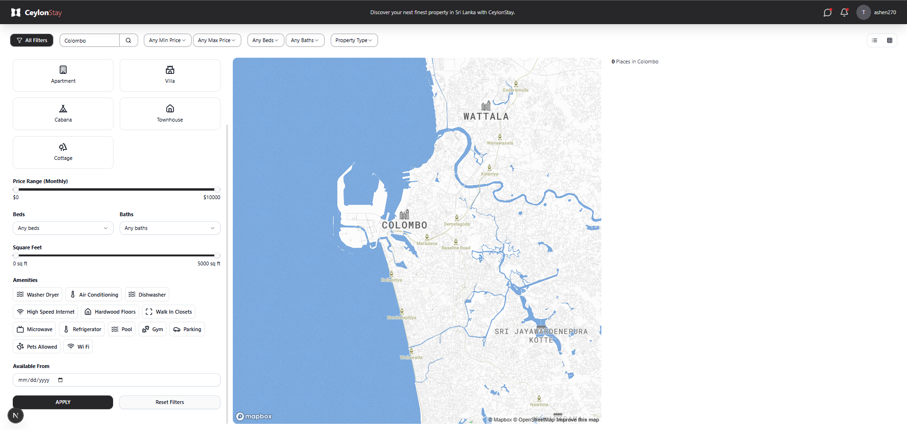

# 🏠 CeylonStay

> A web-based platform for property management featuring role-based login for tenants and managers. Tenants can book properties, while managers can oversee and manage their listings.

---

## 📸 Screenshot

---

## 🚀 Tech Stack

### 🧱 Core Technologies
- [Next.js 13](https://nextjs.org/) – React framework with App Router  
- [React 19](https://reactjs.org/) – Latest React with modern features  
- [TypeScript](https://www.typescriptlang.org/) – Type-safe development  
- [Tailwind CSS](https://tailwindcss.com/) – Utility-first CSS framework  

### 🧩 UI & Components 
- [shadcn/ui](https://ui.shadcn.dev/) – Beautiful, reusable components  
- [Lucide React](https://lucide.dev/) – Beautiful & consistent icons  

### 🗃️ State & Data Management
- [Redux](https://redux.js.org/) – A JS library for predictable and maintainable global state management  
- [Axios](https://axios-http.com/) – HTTP client  

### 🛠️ Development Tools
- [ESLint](https://eslint.org/) – Code linting  
- [Prettier](https://prettier.io/) – Code formatting  
- [Turbopack](https://turbo.build/pack) – Ultra-fast bundler  

